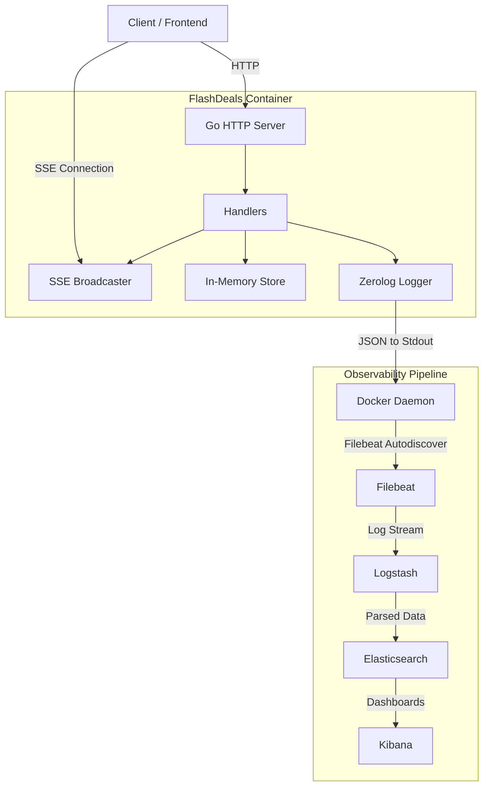

# ⚡ FlashDeals API


A high-performance, concurrency-safe HTTP API designed for real-time **flash sales**.

Built with **Go**, featuring:

- Real-time updates with **SSE**
- Structured logging with **Zerolog**
- Full **ELK Stack pipeline** (Filebeat → Logstash → Elasticsearch → Kibana)
- Optional **SQLite persistence** for deals and orders

---

## 🏗 Architecture Overview



---

## 🚀 Getting Started

### Prerequisites

- Go 1.22+
- Docker
- Docker Compose
- Make (optional)

---

## 🐳 Run the Entire Stack (Go API + ELK)

```sh
docker compose up -d --build
```

---

## 🏃 Run Only the Go API Locally

```sh
make tidy
make run
```

---


### Build the Complete Project

```sh
docker compose up -d
```

---

# 📡 API Endpoints

### Create a Deal

```sh
curl -s -X POST http://localhost:8080/deals \
  -H "Content-Type: application/json" \
  -d '{"title":"Gaming Mouse","price":25000,"stock":5,"active":true}'
```

### List Deals

```sh
curl -s http://localhost:8080/deals
```

### Create Order

```sh
curl -s -X POST http://localhost:8080/orders \
  -H "Content-Type: application/json" \
  -d '{"deal_id":"<DEAL_ID>", "qty": 1}'
```

### SSE Events

```sh
curl -N http://localhost:8080/events
```

---

# 📊 ELK Observability

Kibana:  
```
http://localhost:5601
```

Index pattern:
```
flashdeals-*
```

---

# 🧪 Load Testing

### Create 100 Deals

```sh
for i in {1..100}; do
  curl -s -X POST http://localhost:8080/deals     -H "Content-Type: application/json"     -d "{"title":"Item $i", "price":1000, "stock":5, "active":true}"
done
```

### GET Flood

```sh
for i in {1..200}; do curl -s http://localhost:8080/deals > /dev/null; done
```

---

# 📂 Project Structure

| Directory | Description |
|----------|-------------|
| `/cmd` | Main entrypoint |
| `/internal/httpapi` | Handlers, router, middleware |
| `/internal/store` | In-memory & SQLite stores |
| `/internal/logx` | Zerolog logger wrapper |
| `/internal/sse` | Server-Sent Events hub |
| `/filebeat` | Filebeat configs |
| `/docker-compose.yml` | App + ELK orchestration |

